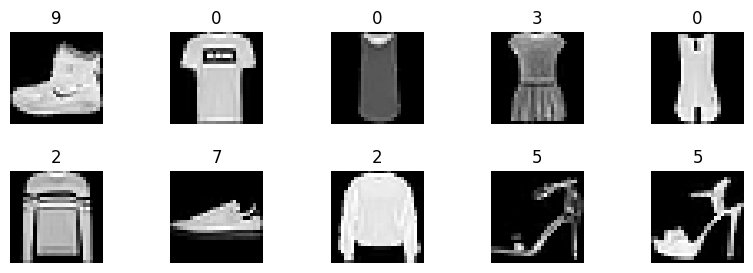
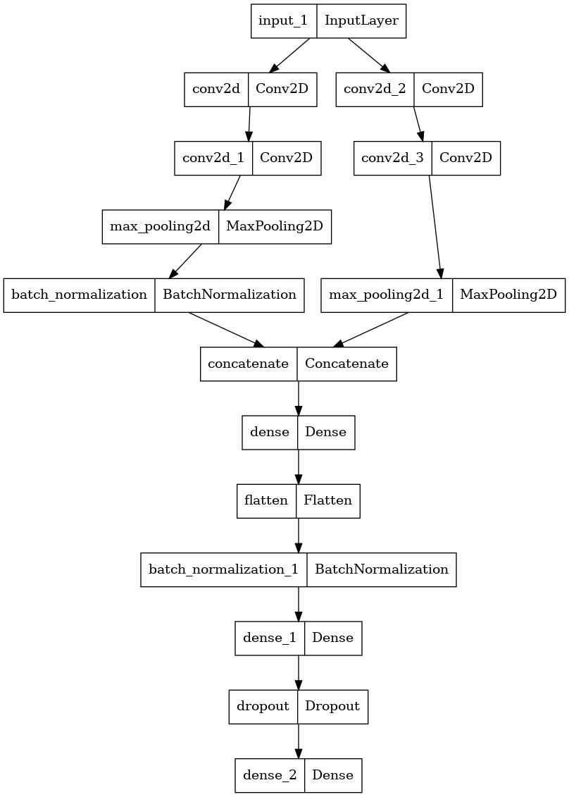
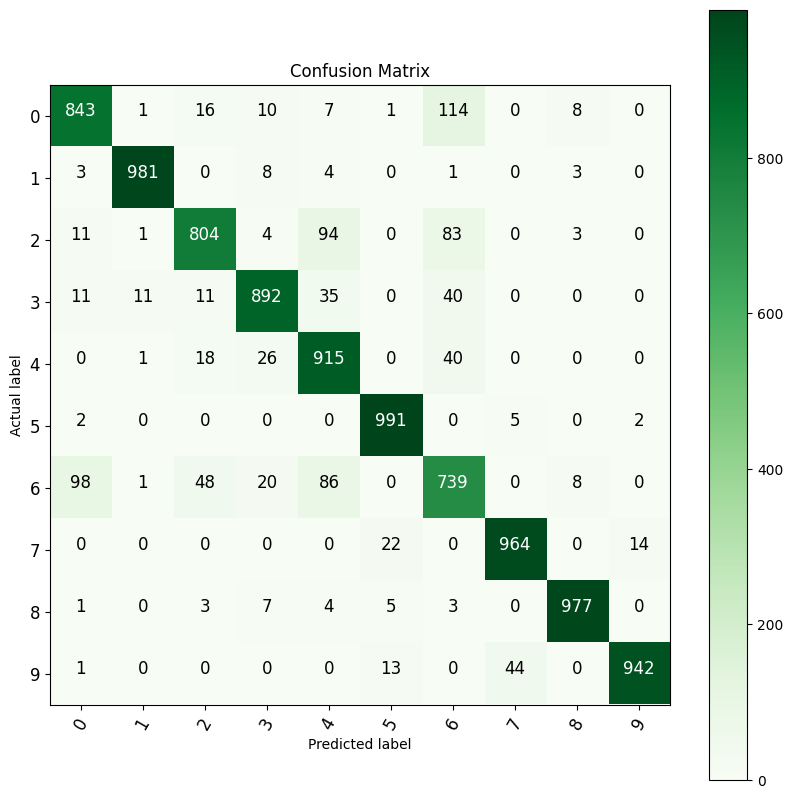

# Fashion-MNIST Classification

**Author:** Sevendi Eldrige Rifki Poluan

## Project Overview

This project uses a deep learning approach to classify fashion items from the Fashion-MNIST dataset. The implementation features a parallel CNN (Convolutional Neural Network) architecture with dual pathways for feature extraction.

## Dataset

The Fashion-MNIST dataset contains:
- **60,000 training images**
- **10,000 test images**
- **10 clothing categories**: t-shirts, trousers, pullovers, dresses, coats, sandals, shirts, sneakers, bags, ankle boots
- **Image format**: 28×28 grayscale pixels

## Model Architecture

The model uses a parallel CNN architecture with:
- **Two independent convolutional pathways** for feature extraction
- **Dual Conv2D layers** (32 filters each) in each pathway
- **Max pooling** and batch normalization for regularization
- **Concatenation layer** to merge feature maps
- **Dense layers** (32 and 256 units) for classification
- **Dropout (50%)** to prevent overfitting
- **Softmax activation** for 10-class output

## Results

The model achieves excellent performance on the Fashion-MNIST test set, with detailed metrics visualized through:
- Confusion matrix for per-class analysis
- Model architecture visualization
- Sample prediction visualization

## Visualizations

### Sample Fashion Items

*Figure 1: Sample of 10 fashion items from the training dataset*

### Model Architecture

*Figure 2: Parallel CNN architecture with two independent pathways*

### Confusion Matrix

*Figure 3: Confusion matrix showing classification results across all 10 categories*

## Usage

Run the Jupyter notebook `fasion-mnist.ipynb` to:
1. Import libraries and load the dataset
2. Visualize sample training images
3. Preprocess and batch the data
4. Build and compile the model
5. Train with early stopping
6. Save the trained model
7. Evaluate on test set with confusion matrix

## Output Files

- `saved-model.h5`: Trained model weights
- `figures/`: Extracted visualizations (sample images, architecture, confusion matrix)

## References

### Dataset
- **Fashion-MNIST Dataset**: [GitHub Repository](https://github.com/zalandoresearch/fashion-mnist)
  - Xiao, H., Rasul, K., & Vollgraf, R. (2017). Fashion-MNIST: a Novel Image Dataset for Benchmarking Machine Learning Algorithms.
  - Dataset: 60,000 training images and 10,000 test images of fashion items

### Deep Learning Frameworks
- **TensorFlow**: [Official Documentation](https://www.tensorflow.org/)
- **Keras API**: [Keras Documentation](https://keras.io/)

### Related Papers & Resources
- LeCun, Y., Bengio, Y., & Hinton, G. (2015). Deep Learning. *Nature*, 521(7553), 436-444.
- Krizhevsky, A., Sutskever, I., & Hinton, G. E. (2012). ImageNet Classification with Deep Convolutional Neural Networks. *NeurIPS*.
- He, K., Zhang, X., Ren, S., & Sun, J. (2016). Deep Residual Learning for Image Recognition. *CVPR*.

### CNN Architecture Concepts
- Convolutional Neural Networks (CNNs): [Stanford CS231n](http://cs231n.stanford.edu/)
- Batch Normalization: [Original Paper](https://arxiv.org/abs/1502.03167)
- Dropout as Regularization: [Original Paper](https://jmlr.org/papers/v15/srivastava14a.html)

### Tools & Libraries
- **NumPy**: Numerical computing library
- **Matplotlib**: Visualization library
- **Scikit-learn**: Machine learning utilities
- **Jupyter**: Interactive computing environment
